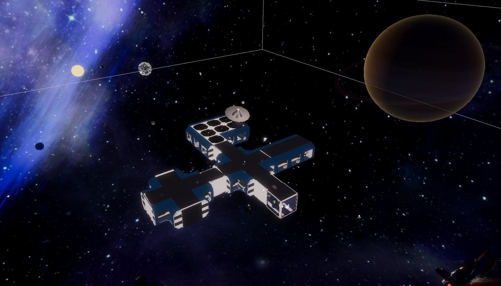
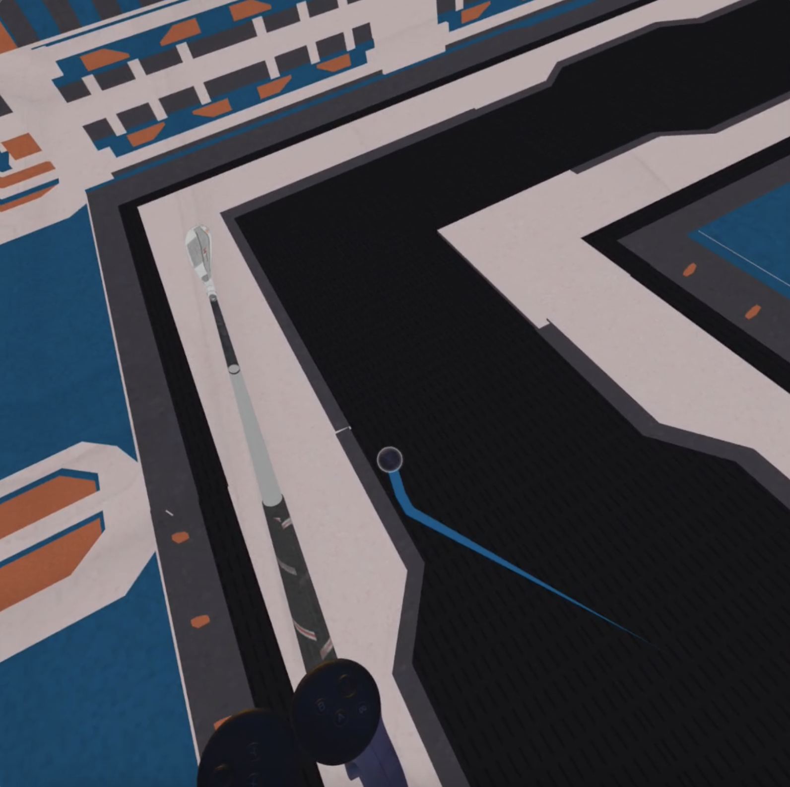
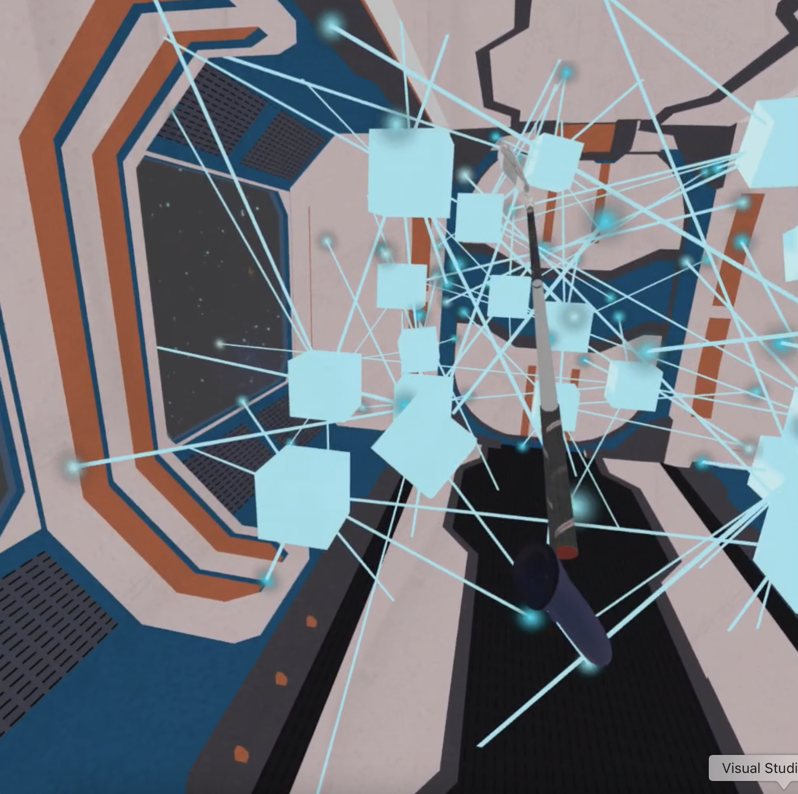
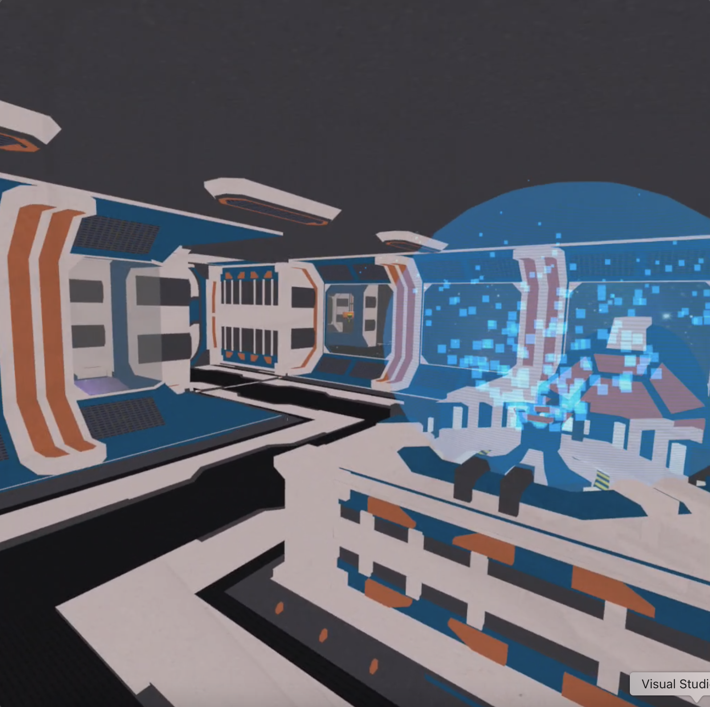

# Golf Escape

VR golf escape room for COMP 790 VR Game Development.

Watch a video demo [here](https://youtube.com/shorts/g-Aha1MsgE4).

Locomotion is done with 6 DOF head tracking and teleportation using controller joystick. Players can interact with various game objects using the golf club tracked to the users controller.

To improve the experience, sound effects are used for button pressed, ball collisions, and proximity near the central computer display. There is also ambient sound from the space station throughout the game.

Custom shaders are applied to the Sun, Earth, Moon, and Saturn. Particle effects are used for the cubes and projector.

Assets were collected from the Unity Asset Store.

